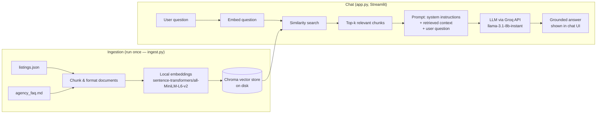

# Property AI — RAG Chatbot for Real Estate

[](https://github.com/michael-bellido/property-ai-rag/actions/workflows/ci.yml)

A Retrieval-Augmented Generation (RAG) chatbot that answers questions about
property listings and agency policies by retrieving relevant information
from a local knowledge base before generating a response — instead of
relying purely on an LLM's own (often outdated or hallucinated) knowledge.

> **Note on the data:** the property listings and agency FAQ used here are
> entirely fictional, created for demonstration purposes. They are **not**
> derived from any real client, agency, or confidential data. "Sunset Realty
> Group" does not exist.

## Why this project

Most public LLMs know nothing about a specific business's current listings,
prices, or policies, and will either refuse to answer or invent plausible
sounding but wrong details. RAG fixes this by grounding every answer in
retrieved source documents, which is the same pattern used in production
customer-support and internal-knowledge chatbots.

## How it works



1. **Ingestion** (`app/ingest.py`, run once): loads the property listings and
   FAQ, splits the FAQ into section-sized chunks, embeds everything locally
   with a HuggingFace `sentence-transformers` model (no API key needed for
   this step), and persists the vectors to a local Chroma database.
2. **Retrieval + generation** (`app/app.py`, Streamlit UI): when the user
   asks a question, the app embeds the question, retrieves the most similar
   chunks from Chroma, and sends them as context to an LLM (Groq's free-tier
   API, model `llama-3.1-8b-instant`) so the answer is grounded in the
   retrieved data rather than the model's own guesses.
3. **Conversation memory**: a bare follow-up like *"what about cheaper
   ones?"* embeds poorly on its own, so before retrieval the app asks the
   LLM to rewrite it into a standalone query (e.g. *"What cheaper villas do
   you have?"*) using the last few turns of the conversation. That
   standalone query is what actually gets vector-searched; the recent
   conversation itself is also replayed to the LLM when generating the
   answer, so multi-turn conversations stay coherent without re-stating
   context every time.

## Tech stack

- **LangChain** — orchestration (document loading, splitting, vector store, LLM calls)
- **Chroma** — local vector database
- **sentence-transformers** (`all-MiniLM-L6-v2`) — local embeddings, free and offline
- **Groq API** (`llama-3.1-8b-instant`) — fast, free-tier LLM inference
- **Streamlit** — chat UI

## Setup

1. Clone the repo and create a virtual environment:

   ```bash
   python -m venv venv
   source venv/bin/activate   # Windows: venv\Scripts\activate
   pip install -r requirements.txt
   ```

2. Get a free Groq API key at [console.groq.com/keys](https://console.groq.com/keys)
   (no credit card required).

3. Copy `.env.example` to `.env` and paste in your key:

   ```bash
   cp .env.example .env
   ```

4. Build the vector store (run once, or again after editing the data files):

   ```bash
   python app/ingest.py
   ```

5. Launch the chat app:

   ```bash
   streamlit run app/app.py
   ```

## Tests

Unit tests cover the parts of the pipeline that don't require an LLM call
or a downloaded embedding model — the EN/ES question-language heuristic,
the conversation-memory helpers (follow-up condensation, history bounding),
source-citation formatting, and the ingestion pipeline's document-building
functions. They run in a couple of seconds and need no `GROQ_API_KEY`.

```bash
pip install -r requirements-dev.txt
pytest -v
```

Every push to `main` and every pull request runs this same suite via
[GitHub Actions](.github/workflows/ci.yml) — see the badge above.

## Project structure

```
property-ai-rag/
├── .github/
│   └── workflows/
│       └── ci.yml        # runs pytest (+ ruff, non-blocking) on every push
├── app/
│   ├── ingest.py          # builds the local vector store from data/
│   └── app.py             # Streamlit chat UI (retrieval + LLM call)
├── data/
│   ├── listings.json      # fictional property listings
│   └── agency_faq.md      # fictional agency FAQ
├── tests/
│   ├── conftest.py
│   ├── test_ingest.py
│   ├── test_language_detection.py
│   ├── test_conversation_memory.py
│   └── test_sources.py
├── requirements.txt
├── requirements-dev.txt   # requirements.txt + pytest/ruff, for local dev & CI
├── pytest.ini
├── pyproject.toml         # ruff config
├── .env.example
└── .gitignore
```

## Possible extensions

- Swap Chroma for a hosted vector DB (e.g. Pinecone, Qdrant) for a production deployment.
- Add source citations with clickable listing links.
- Deploy on Streamlit Community Cloud or a small VPS for a live demo link.
- Add an automated evaluation script that checks answers stay grounded in the retrieved context.

## Disclaimer

This is a portfolio/demo project. The listings, prices, and FAQ content are
synthetic and created solely to illustrate the RAG pattern. Any resemblance
to real properties or agencies is coincidental.
